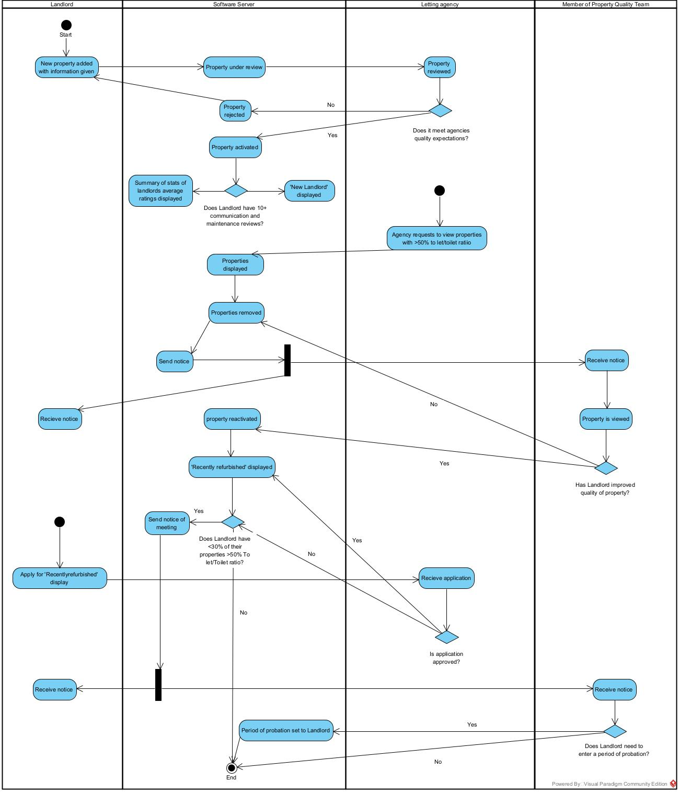
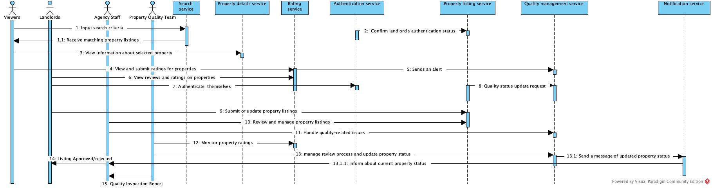
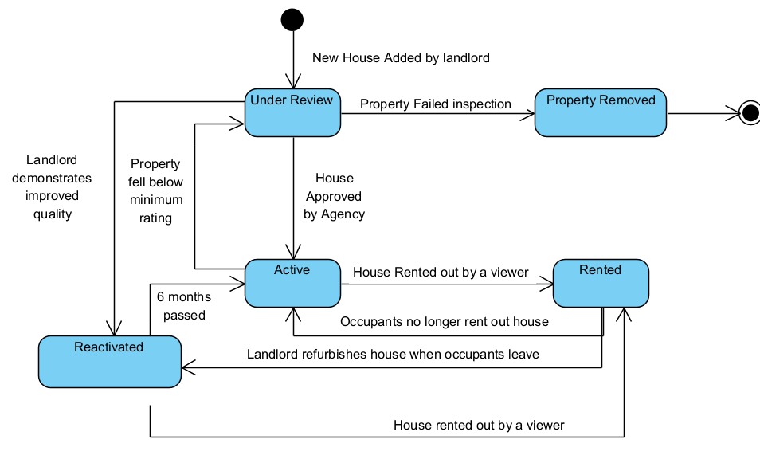
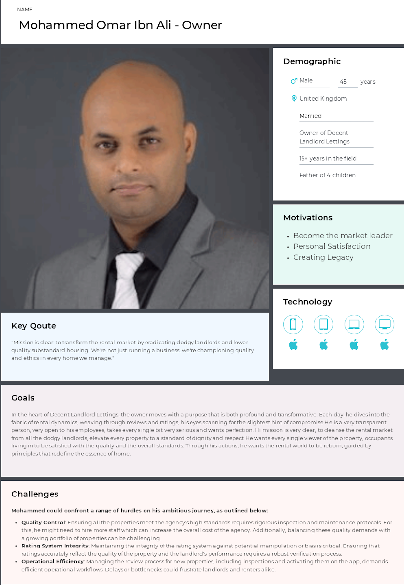
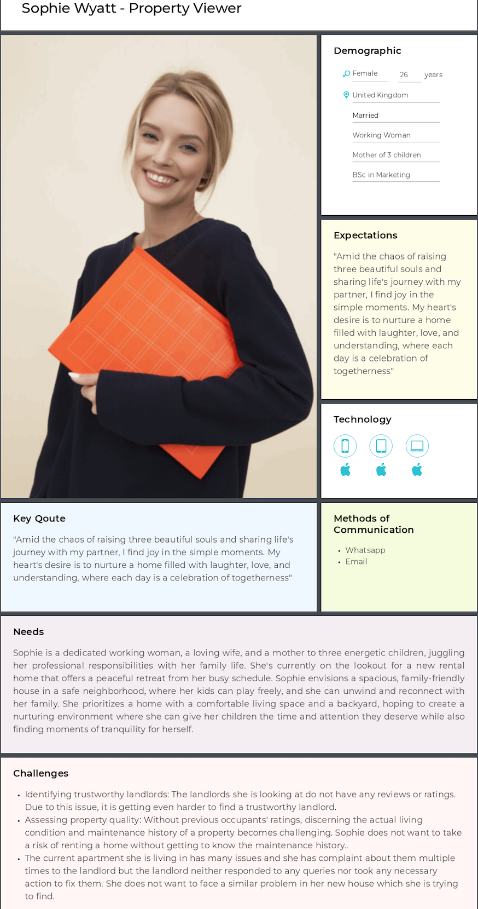
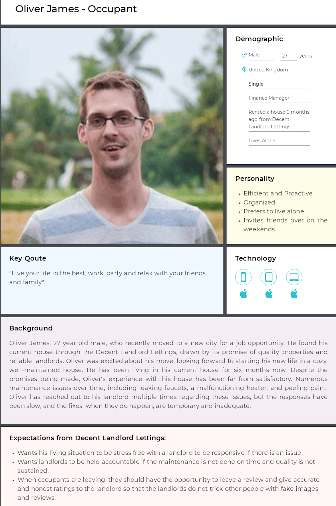
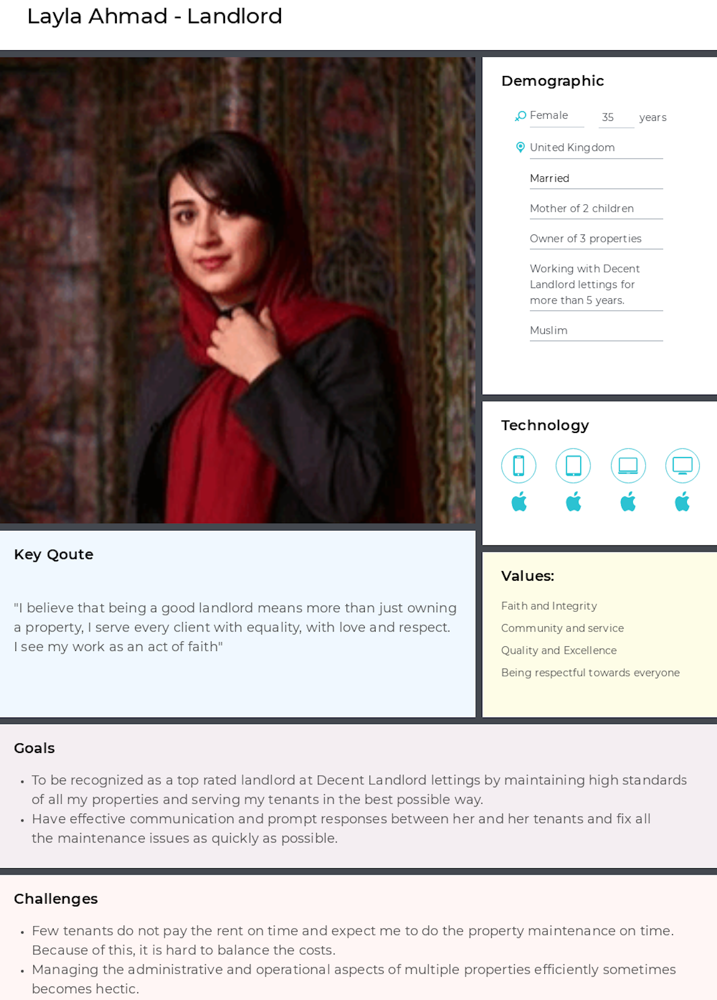
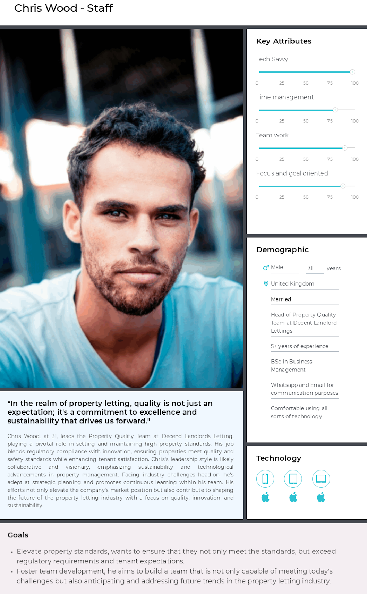

# Coursework 1
### Requirments and Specifications for Decent Landlord Lettings
#### This is due in before the end of labs 29/02/2024
[Planning document](courework1_planning.md)
### Table of Contents
1) [Activity Diagram](#activity-diagram)
2) [Sequence Diagram](#sequence-diagram)
3) [State Diagram](#state-diagram)
4) [Set of Personas](#set-of-personas)
5) [User Stories](#user-stories)
6) [Low Fidelity Prototype](#low-fidelity-prototype)
7) [How everything links together](#how-everything-links-together)
7) [Specifications and Requirements](#specifications-and-requirements)

### Introduction:

Team 46 have been tasked to	establish the requirements for a peice of software for a prospective client Decent Landlord Lettings, an innovative house rental firm that aims to raise rental property standards and increase transparency between tenants and landlords. To establish the requirements, our appraoch involves developing set of comprehensive diagrams and models which illustrate the software's functionality and process. The markdown includes a state diagram to visualise the property objects state transitions, Then we have the user personas to represent the app's diverse user base, then the user stories  to articulate functional requirements from users' perspectives. Then we have the two high level diagrams/models: the activity diagram and the sequence diagram. Activity Diagram to map out the software's operational flow, and a Sequence Diagram to detail system component interactions. This structured approach ensures a comprehensive blueprint for a platform designed to redefine rental experiences by eliminating poor-quality properties and dodgy landlords, thereby establishing a reliable and user-friendly rental ecosystem.

## Actors
### Primary Actors
- Viewers
- Landlords
- Agency
- Agency staff
- Occupants

### Secondary Actors
-  Property Quality Team

### Tertiary 
- Decent Landlord Lettings

## Activity Diagram (Specification)
### Our Reasoning
An activity diagram is a vital tool for visualizing workflows and program flows within a software system. It not only maps out activities but also helps pinpoint bottlenecks and constraints, essential for enhancing performance and user experience. Beyond illustrating program flow, it shows both frontend and backend processes, offering a clear view of system functionalities. Decision points are prominently featured, clarifying the logic behind various choices within the software, which is vital in the backend of the software we are planning to create.

In essence, the activity diagram serves as a comprehensive representation of the software's operation, aiding in effective communication and development. It's particularly useful for defining use cases precisely, especially when dealing with complex features.

### Assumptions made
- (1) Landlord has to put in new request if property request is rejected
- (2) There is no minimum number of houses for the <33% of Landlord’s properties >50% To let/Toilet ratio
- (Follow up from previous) For when the Landlord has <33% of their properties >50% To let/toilet ratio the landlord is informed about this

### Questions for the Stakeholder
- (1) What happens when a property is rejected from its request to be put on the website?
- (2) Is there a minimum number of houses for the <33% of Landlord’s properties >50% To let/Toilet ratio?
- (Follow up from previous) Is the landlord informed when their properties are under 50% To let/Toilet ratio?
- How does the agency determine whether a property is suitable to be on the software?
- How does the agency determine whether a property is ‘Recently refurbished’ or not?

## Sequence Diagram (Specification)
### Our Reasoning 
Sequence diagrams are very useful for facilitating precise information sharing among individuals and systems. They offer a comprehensive depiction of interactions, showcasing how landlords, customers, and the software exchange information. Essentially, these diagrams illustrate a sequence of messages between key components, providing clarity on user interactions. This choice aligns with our project goals, as it enables precise representation of these interactions, in line with the direct quote from the brief: "Tammie wants mostly high-level design specifications to present."

Furthermore, sequence diagrams allow for the analysis of software behavior and validation of assumptions made during diagram creation. They complement low-fidelity prototypes, enhancing our understanding of system functionality. Additionally, sequence diagrams can specify function calls in Java objects, offering detailed insights into software operations. By meeting Tammie's preference for high-level design specifications, sequence diagrams communicate complex processes in a clear way.

 

### Description:

### Actor-Object interactions:

- **Viewers**:
    - **SearchService**: Viewers use this service to input search criteria and receive matching property listings.
    - **PropertyDetailService**: Once they've selected a property, they interact with this service to view detailed information about the property.
    - **RatingService**: They use this service to submit ratings for properties they've viewed or rented, as well as to view ratings from other users.
- **Landlords**:
    - **AuthenticationService**: Landlords must authenticate themselves to manage their listings and view private information.
    - **PropertyListingService**: They submit new property listings or update existing ones through this service. 
    - **RatingService**: Landlords use this to view the ratings and reviews left by viewers on their properties.
- **Agency Staff**:
    - **PropertyListingService**: Agency staff use this service to review new property listings submitted by landlords, approve or reject them, and manage property details.
    - **QualityManagementService**: They interact with this service to handle quality-related issues reported by the Property Quality Team or triggered by low ratings.
- **Property Quality Team**:
    - **RatingService**: They monitor property ratings to identify properties that may require quality review.
    - **QualityManagementService**: They use this service to manage the review process, update property statuses, and initiate any necessary follow-up actions with landlords or maintenance services.
    
    ### Object-Object interactions:
    
    - **RatingService to QualityManagementService**:
        - When a Viewer submits a rating that is below a certain threshold, the RatingService sends an alert to the QualityManagementService. This could trigger a quality review process.
    - **PropertyListingService to QualityManagementService**:
        - The PropertyListingService may request a quality status update from the QualityManagementService when a new property is listed or if a property's rating changes significantly. This ensures that property listings are up-to-date with their quality status.
    - **QualityManagementService to NotificationService**:
        - After the QualityManagementService updates the status of a property (e.g., requires maintenance, fails to meet standards), it sends a message to the NotificationService to inform the relevant Landlord or Agency Staff.
    - **AuthenticationService to PropertyListingService**:
        - The AuthenticationService may send a token or a confirmation of a Landlord's authentication status to the PropertyListingService, enabling the Landlord to make changes to their property listings.
        
        ### Actor-Actor interactions:
        
        1. **Agency Staff notifies Landlord of property listing status**:
            - Is a communication process where the staff reviews the submitted property details against the platform's standards and criteria. Once a decision is made, a notification is sent to the Landlord indicating whether their property listing has been approved or rejected.
        2. **Property Quality Team reports to Agency Staff about property inspections**:
            - The Quality Team conducts inspections based on established criteria to ensure listings meet the required standards. They then compile their findings into a report and communicate this to the Agency Staff. This report could trigger further actions depending on the issues found, such as requiring the landlord to make improvements or even delisting the property if it fails to meet the criteria.
    

## Assumptions:

1. **Authentication Reliability**: The system assumes that the authentication service reliably identifies landlords.
2. **Rating Integrity**: Ratings submitted by viewers are assumed to be genuine and not manipulated.
3. **Notification Delivery**: There is an assumption that notifications sent by the notification service are received and acknowledged.
4. **Quality Control**: The system assumes that the Property Quality Team will act on alerts in a timely and effective manner.

## Questions:

1. **How does the system handle fraudulent ratings or spam?**
2. **What is the process if a landlord disputes a rating?**
3. **How are privacy concerns addressed when displaying ratings?**
4. **What are the criteria for a property listing to be approved or rejected by the agency staff?**
5. **Is there a process for viewers to appeal if their rating is removed or moderated?**

## State Diagram (Specification)
### Our Reasoning
#### State diagrams are a powerful tool for representing the dynamic behaviour of an object, particularly in reactive systems where external actions drive state changes. In the context of the application for Decent Landlord Lettings , which is inherently reactive, state diagrams excel at illustrating the event-driven transitions that occur throughout the property objects lifecycle. As direct inputs cannot be made on the house itself, changes in its state are managed by a set of actions initiated by all the relevant actors; viewers, occupants, agency staff, and landlords. Given the multitude of potential states a house object can traverse, a state diagram provides a valuable abstraction. It distills the complexity of the system into a visual representation, offering clarity in understanding the intricate relationships and transitions between states. This abstraction facilitates effective communication of the large amount of states a house object can have, whilst including all the relevelant actors in the most consise way.

### Viewer and Occupant Rating Influence
#### The actions of viewers and occupants play a pivotal role in shaping the house's states. Ratings provided by viewers during property viewing or by occupants upon departure trigger state transitions, reflecting the perceived quality of the property and the landlord's management. If ratings of the house are then too low, transitions would occur such as moving from an active state to being under review. Actions would then then need to be made by a landlord to have the house reactivated or ultimately removed. This demonstrates the direct impact of user interactions on the house's state in the software application. 

 
### Assumptions
-  Client did not provide what state a house should be in when under renovation between tenants. We would require additional communication with client about this aspect, otherwise will assume the house is put in the property removed state, during this period of time. 
- We had to make the assumption that the under review state of the house, was the same state for when a new house was added, as well as when a house is under review after falling below minimum rating. In producion we will need to add a way to differentiate between them. Maybe just a boolean variable to say recently added?

### Questions
- How long should houses stay in removed state?
- When a house is removed by a landlord. Is it held in the removed state for a set period of time, or removed instantly?
- Should a property be able to change state directly from rented to being removed?  

### Notes
- Diagram does not take into account all inputs which result in the changes in state (e.g. house rating comes from 2 different actors. Will need to take this into account within development)
- Active and reactive are the only two states for the object that are viewable to the viewers. For landlords and all actors part of admin team(agency, agency staff) the house should be viewable in all states. 
- When house is renovated, the diagram does not take into account the approval process by admin team to give it the label of recently refurbished. Therefore, for house to move from rented to reactivated would require admin approval.

## Set of Personas (Requirements)
### User persona 1

### User Persona 2

### User Persona 3

### User Persona 4

### User Persona 5

### Reasoning for chooing personas:

The reason as to why we decided to go with user personas is because it allows us to have user-centered design which enables us to maintain focus on our main users/target audience throughout the development of the software/application. Additionally, by focusing on the main users of the software/application, the development team can prioritize features more effectively. For instance, the importance of making landlord ratings anonymous to encourage honest feedback from past tenants can be better appreciated through the lens of a tenant persona. Finally, personas will allow us to ensure that testing and validation covers a broad range of user interaction. 

### Assumptions

- The software/application will just be covering a city and all the viewers viewing the property are in one region. 

- Decent Landlord Lettings have 20-60 employees in their agency.

- There are no penalties for the landlords currently they fail to maintain the quality standards. 

### Questions:

1. What cities and the area of that city will the software cover?

2. How many properties will each landlord be allowed to show on the software?

3. Do landlords have to pay certain amount/monthly to have their properties active on the software?

4. What current system/software are they using to deal with landlords and tenants to maintain standards and keep everything in order?

5. How do the viewers book their appointment to view the properties?
## User Stories (Requirements)
### Our Reasoning
Using the format "As a role, I want goal, so that outcome," we aim for a fast and lightweight approach to documenting requirements. Each requirement is condensed into a single sentence, articulating the role, goal, and outcome succinctly. This method was chosen to ensure clarity and simplicity in setting out the goals necessary to satisfy all stakeholders involved.

By aligning requirements with selected personas, we can tailor the software to meet specific user needs effectively. This simplification aids in presenting plans to clients, enhancing their understanding of project requirements. Moreover, the concise nature of these requirements facilitates easy readability and maintenance, enabling the creation of a comprehensive checklist for project tasks. This approach breaks down projects into manageable chunks, streamlining development and ensuring efficient progress.
1. **As a Viewer, I want to:**
    - Search for properties using specific criteria to find the best match for my needs.
    - Access detailed information about properties I'm interested in to make informed decisions.
    - Submit ratings for properties I have viewed or rented to help others in their decision-making process.
    - View aggregate ratings and reviews from other users to gauge property quality.
2. **As a Landlord, I want to:**
    - Authenticate my identity to securely manage my property listings.
    - Submit new property listings to the platform, ensuring they reach potential renters.
    - Receive notifications about the status of my property listings to stay updated on the approval process.
    - Review ratings and feedback provided by viewers to improve my properties.
3. **As a member of the Agency Staff, I want to:**
    - Review and approve property listings to maintain high standards on the platform.
    - Manage property details to ensure accurate and up-to-date information is available.
    - Address quality-related issues based on feedback and ratings to maintain a trustworthy platform.
4. **As a member of the Property Quality Team, I want to:**
    - Monitor property ratings to identify those that may require a quality review.
    - Manage the review process for properties and update statuses to reflect current conditions.
    - Communicate with Agency Staff regarding inspection findings to ensure proper action is taken.
### Assumptions:

1. Viewers can accurately and honestly rate properties based on their experiences.
2. Landlords have access to and are willing to use the platform to manage listings and view feedback.
3. The system provides a reliable and secure authentication mechanism for landlords.
4. Agency Staff have the necessary tools to review listings and address quality issues effectively.
5. The Property Quality Team has a clear set of criteria for reviewing and reporting on property quality.

### Questions:

1. What mechanisms are in place to verify the authenticity of ratings and reviews?
2. How does the system ensure the privacy and security of the ratings process?
3. What steps are taken when a landlord or viewer disputes a rating or review?
4. How is the user informed of the outcome of quality reviews or disputes?
5. What feedback or support is provided to landlords to improve property listings that don't meet quality standards?
## Low Fidelity Prototype
#### To access our prototype press on the link below. You will then be redirected to a page displaying the renders of each of the pages of our prototype. 
#### Note: After accessing the link, tap on the run button in the top right. It will take you to our interactive version of the prototype. 

[Click here to visit our Figma Prototype ](https://www.figma.com/file/6Xdxqb8HjS2KvqjVNBzyo0/CW1-Prototype?type=design&node-id=0%3A1&mode=design&t=YNpPN06ZTzJYgL33-1)

#### This will provide our client, Decent Landlord Lettings, a first look at how their software application will look and what basic interactions will be available. The prototype helps us to gain some early feedback from the client, and help us cover all the clients requirements for the software we develop. Furthermore, it gives the client a framework evaluate their requirments and start giving us further requirments on the design and information to be included on each page of the user interface. 

### Assumptions
- Decent Landlord lettings did not provide any requirements on how they would like the software to look
- We assumed what information to display, base upon what was most relevant as per the requirments brief, however the prototype will allow us to discuss with our client about what is to be displayed on each page

### Notes
- Prototype doesn't cover all screens of the final product, as it is still low fidelity. It doesn't not provide administrative views or the views specific to that of the landlord.

## How Everything Links Together

### Activity Diagram + Sequence Diagram + State Diagram:
- The activity diagram provides an overview of the system's workflow, outlining the sequence of activities and decision points.
- The sequence diagram offers a detailed view of interactions between actors and objects within the system, illustrating how specific actions lead to outcomes.
- The state diagram depicts the dynamic behavior of objects in the system, showing how they transition between different states based on user interactions and system events.
which
- The activity diagram linked with the state diagram, helps to give the state diagram a more in-depth explanation of the iterations which result in the state changes. The state diagram helps to give a more contextualised version of what the events that occur in the acitity diagram cause
- Together, these diagrams provide a comprehensive understanding of the system's operation, from high-level workflow to detailed interactions and state changes.
### User Stories + Set of Personas:
- User stories document specific requirements from the perspective of different user roles or personas, articulating their goals and desired outcomes.
- The set of personas represents distinct user groups, each with unique needs, preferences, and goals.
User stories are aligned with personas to ensure that requirements capture the diverse needs of users represented by the personas.
- By linking user stories with personas, developers can prioritize features and design elements that address the most critical user needs identified through personas.
### Sequence Diagram + User Stories:
- The Viewer's actions of searching, viewing property details, and submitting ratings directly correspond to interactions with the SearchService, PropertyDetailService, and RatingService in the sequence diagram.
- The Landlord's need to authenticate, submit listings, and view ratings ties into interactions with the AuthenticationService, PropertyListingService, and RatingService.
- The Agency Staff's role in reviewing property listings and managing quality issues is visualized in the sequence diagram through their communication with the PropertyListingService and QualityManagementService.
- The Quality Team's monitoring of property ratings and management of the review process corresponds to the flows involving the RatingService and QualityManagementService.

## Specifications and Requirements 
### *Requirements:*

1. *Functional Requirements*:
    - *Dynamic Property Listings*: The system must allow landlords to list properties and update listings as needed. Listings are subject to review by agency staff before being published.
    - *User Ratings and Reviews*: Viewers and occupants can rate and review properties, influencing their visibility and status within the platform.
    - *Quality Management*: Properties falling below a certain rating threshold are subject to review and potential removal to ensure high standards.
2. *Non-Functional Requirements*:
    - *Security and Authentication*: Secure authentication processes for landlords and agency staff to manage listings and reviews.
    - *Usability*: An intuitive interface for all user types, ensuring easy navigation and interaction with the system.
    - *Performance*: Fast response times for search and property management functions, handling high user volumes efficiently.

### *Specifications:*

- *Activity Diagram Integration*: Highlights the workflow from property listing to reviews, identifying key decision points and actions required from all user roles.
- *State Diagram Alignment*: Clarifies the lifecycle of a property listing, including states from active to under review, and the conditions triggering state changes.
- *Sequence Diagram Connectivity*: Details the interactions between users and the system, ensuring that functionalities like search, listing, rating, and quality review are clearly mapped out.
- *Assumptions and Questions Addressed*: Incorporates feedback mechanisms for rejected listings, criteria for property quality, and processes for managing underperforming listings.